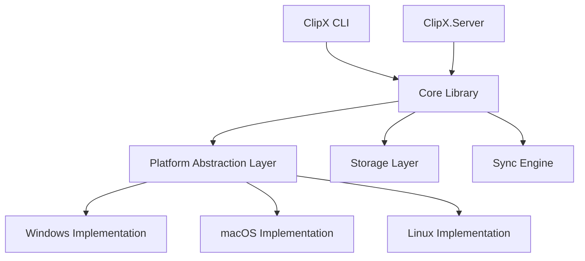
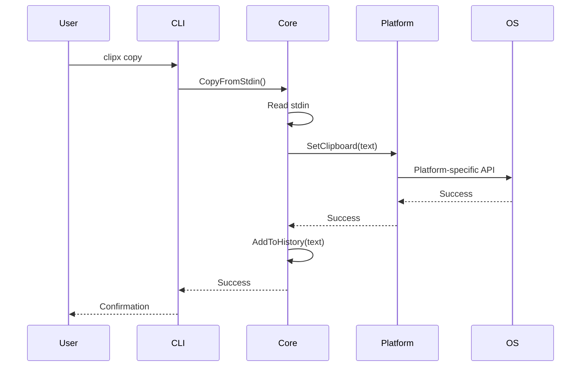

# ClipX Design Document

## 1. Project Overview

ClipX is a cross-platform clipboard manager designed to provide a native, familiar experience on each supported platform while maintaining feature parity and data compatibility across all platforms.

### 1.1 Target Platforms

| Platform | OS | Architecture | Priority |
|----------|-----|--------------|----------|
| Windows | Windows 10/11 | amd64 (x86_64) | High |
| macOS | macOS 12+ | ARM64 (Apple Silicon) | High |
| Linux | Ubuntu 20.04+, Fedora 36+ | amd64, ARM64 | High |

### 1.2 Design Philosophy

**Cross-Platform Native Experience**: ClipX must feel like a native application on each platform, respecting platform conventions while maintaining consistent functionality.

**Key Principles**:
- **Platform Integration**: Follow each platform's design guidelines and conventions
- **Familiar UX**: Use platform-standard terminology, keyboard shortcuts, and behaviors
- **Abstraction**: Platform-specific implementations hidden behind common interfaces
- **Testability**: All platform-specific code must be testable on all platforms
- **Distributability**: Package according to platform expectations

---

## 2. Platform-Specific Considerations

### 2.1 Clipboard Access

Each platform has different APIs and behaviors for clipboard access:

| Platform | API/Mechanism | Considerations |
|----------|---------------|----------------|
| **Windows** | Win32 API (`Clipboard` class in .NET) | - Requires STA thread for some operations<br>- Supports multiple clipboard formats<br>- May require COM initialization |
| **macOS** | NSPasteboard (via P/Invoke or native interop) | - Sandbox restrictions may apply<br>- Change count tracking for monitoring<br>- Multiple pasteboard types (general, find, drag) |
| **Linux** | X11 (xclip/xsel) or Wayland (wl-clipboard) | - Multiple clipboard selections (primary, clipboard, secondary)<br>- Display server dependency (X11 vs Wayland)<br>- Requires external tools or X11/Wayland libraries |

**Design Decision**: Create an `IClipboardProvider` interface with platform-specific implementations.

### 2.2 File System Conventions

| Platform | Aspect | Convention |
|----------|--------|------------|
| **Windows** | Config Location | `%APPDATA%\ClipX\` |
| | Data Location | `%LOCALAPPDATA%\ClipX\` |
| | Path Separator | `\` (backslash) |
| | Line Endings | CRLF (`\r\n`) |
| **macOS** | Config Location | `~/Library/Application Support/ClipX/` |
| | Data Location | `~/Library/Application Support/ClipX/` |
| | Path Separator | `/` (forward slash) |
| | Line Endings | LF (`\n`) |
| **Linux** | Config Location | `~/.config/clipx/` (XDG_CONFIG_HOME) |
| | Data Location | `~/.local/share/clipx/` (XDG_DATA_HOME) |
| | Path Separator | `/` (forward slash) |
| | Line Endings | LF (`\n`) |

**Design Decision**: Use .NET's `Environment.SpecialFolder` and platform detection to determine appropriate paths.

### 2.3 User Experience Expectations

| Platform | Expected Behavior |
|----------|-------------------|
| **Windows** | - PowerShell and CMD integration<br>- Windows Terminal compatibility<br>- Standard Windows error messages<br>- Registry integration (optional) |
| **macOS** | - Bash/Zsh shell integration<br>- Terminal.app and iTerm2 compatibility<br>- Respect macOS security/privacy prompts<br>- Potential menu bar integration (future) |
| **Linux** | - Bash/Zsh/Fish shell integration<br>- Works with various terminal emulators<br>- Respects XDG Base Directory specification<br>- systemd integration for services (optional) |

---

## 3. Architecture

### 3.1 Component Overview



### 3.2 Layered Architecture

#### Layer 1: Platform Abstraction Layer
**Purpose**: Isolate platform-specific code

**Interfaces**:
- `IClipboardProvider` - Clipboard read/write operations
- `IFileSystemProvider` - Platform-appropriate paths and file operations
- `IProcessProvider` - Process execution (for external tools on Linux)

**Implementations**:
- `WindowsClipboardProvider`
- `MacOSClipboardProvider`
- `LinuxClipboardProvider` (with X11 and Wayland variants)

#### Layer 2: Core Library
**Purpose**: Business logic, platform-agnostic

**Components**:
- `ClipboardManager` - High-level clipboard operations
- `HistoryManager` - Round-robin history management
- `StorageManager` - Persistence of clipboard history
- `ConfigurationManager` - Application settings

#### Layer 3: Application Layer
**Purpose**: User-facing applications

**Components**:
- `ClipX.CLI` - Command-line interface
- `ClipX.Server` - Sync server (future)

### 3.3 Data Flow



---

## 4. Feature Design

### 4.1 Stage 1: Basic Clipboard Operations

#### Copy from stdin
```bash
# All platforms
echo "Hello World" | clipx copy
cat file.txt | clipx copy
```

**Behavior**:
- Read all text from stdin until EOF
- Copy to system clipboard
- Add to history
- Exit with code 0 on success, non-zero on failure

#### Paste to stdout
```bash
# All platforms
clipx paste
clipx paste > file.txt  # Redirect to save to file
```

**Behavior**:
- Read current clipboard content
- Write to stdout
- Exit with code 0 on success, non-zero on failure

### 4.2 Stage 2: History Management

#### View history
```bash
clipx history
clipx history --limit 10
```

**Behavior**:
- Display clipboard history (most recent first)
- Support pagination/limiting
- Show timestamp and preview of each entry

#### Restore from history
```bash
clipx restore 3        # Restore 3rd item from history
clipx restore --id abc123
```

**Behavior**:
- Restore specified history item to clipboard
- Update history order (move to top)

#### Clear history
```bash
clipx clear
clipx clear --before "2024-01-01"
```

**Behavior**:
- Clear all or filtered history entries
- Require confirmation for destructive operations

### 4.3 Stage 3: Sync Functionality

#### Sync to server
```bash
clipx sync --login
clipx sync --push
clipx sync --pull
clipx sync --auto
```

**Behavior**:
- Authenticate with ClipX.Server
- Push/pull clipboard history
- Enable automatic background sync

---

## 5. Data Models

### 5.1 Clipboard Entry

```csharp
public class ClipboardEntry
{
    public string Id { get; set; }              // Unique identifier (GUID)
    public string Content { get; set; }         // Clipboard text content
    public DateTime Timestamp { get; set; }     // When copied
    public string Source { get; set; }          // Platform/device identifier
    public long SizeBytes { get; set; }         // Content size
    public string ContentHash { get; set; }     // SHA256 hash for deduplication
}
```

### 5.2 Configuration

```csharp
public class ClipXConfiguration
{
    public int MaxHistorySize { get; set; } = 100;
    public string StoragePath { get; set; }
    public bool EnableSync { get; set; } = false;
    public string SyncServerUrl { get; set; }
    public bool AutoSync { get; set; } = false;
    public int AutoSyncIntervalSeconds { get; set; } = 300;
}
```

### 5.3 Storage Format

**Format**: JSON Lines (JSONL) for easy append and streaming
**Location**: Platform-specific data directory
**File**: `clipboard-history.jsonl`

```json
{"id":"abc-123","content":"Hello World","timestamp":"2024-12-11T05:50:00Z","source":"linux-amd64","sizeBytes":11,"contentHash":"a591a6..."}
{"id":"def-456","content":"Another entry","timestamp":"2024-12-11T06:00:00Z","source":"linux-amd64","sizeBytes":13,"contentHash":"b692b7..."}
```

---

## 6. Cross-Platform Testing Strategy

### 6.1 Unit Tests
- All platform-agnostic code (Core layer)
- Mock platform providers for isolated testing
- Target: 90%+ code coverage

### 6.2 Integration Tests
- Platform-specific implementations
- Must run on actual target platforms
- CI/CD pipeline with matrix builds:
  - Windows Server 2022 (amd64)
  - macOS 13+ (ARM64)
  - Ubuntu 22.04 (amd64, ARM64)

### 6.3 Manual Testing Checklist
- [ ] Clipboard operations work on each platform
- [ ] File paths resolve correctly
- [ ] Configuration persists across restarts
- [ ] History survives application updates
- [ ] Error messages are appropriate for platform
- [ ] Shell integration works (pipes, redirects)

---

## 7. Distribution Strategy

### 7.1 Package Formats

| Platform | Format | Distribution Method |
|----------|--------|---------------------|
| **Windows** | `.exe` (self-contained) | - Direct download<br>- Chocolatey package<br>- winget package |
| **macOS** | `.pkg` or `.dmg` | - Direct download<br>- Homebrew formula<br>- Mac App Store (future) |
| **Linux** | `.deb`, `.rpm`, binary | - Direct download<br>- APT/YUM repositories<br>- Snap/Flatpak (future) |

### 7.2 Build Strategy

**Technology**: .NET 8.0 with native AOT compilation (where possible)

**Build Targets**:
- `win-x64` (self-contained, single-file)
- `osx-arm64` (self-contained, single-file)
- `linux-x64` (self-contained, single-file)
- `linux-arm64` (self-contained, single-file)

**CI/CD**: GitHub Actions with matrix builds for all platforms

---

## 8. Security Considerations

### 8.1 Clipboard Data
- **Sensitivity**: Clipboard may contain passwords, API keys, personal data
- **Mitigation**: 
  - Encrypt history at rest (optional, configurable)
  - Secure file permissions on history files
  - Option to exclude sensitive data from history

### 8.2 Sync Server
- **Authentication**: OAuth 2.0 or API key-based
- **Transport**: HTTPS/TLS only
- **Data**: End-to-end encryption for synced clipboard data

### 8.3 Platform-Specific
- **macOS**: Request clipboard access permissions appropriately
- **Linux**: Respect user's umask for file creation
- **Windows**: Use appropriate ACLs for data files

---

## 9. Development Roadmap

### Phase 1: Foundation (Stage 1)
- [ ] Project structure and build system
- [ ] Platform abstraction layer interfaces
- [ ] Windows clipboard implementation
- [ ] macOS clipboard implementation
- [ ] Linux clipboard implementation (X11)
- [ ] Basic CLI (copy, paste, save)
- [ ] Unit and integration tests
- [ ] Documentation

### Phase 2: History (Stage 2)
- [ ] Storage layer implementation
- [ ] History manager
- [ ] CLI history commands
- [ ] Configuration management
- [ ] Enhanced testing

### Phase 3: Sync (Stage 3)
- [ ] ClipX.Server design and implementation
- [ ] Authentication system
- [ ] Sync engine
- [ ] CLI sync commands
- [ ] End-to-end testing

### Phase 4: Polish
- [ ] Performance optimization
- [ ] Enhanced error handling
- [ ] Comprehensive documentation
- [ ] Distribution packages for all platforms
- [ ] User guides and examples

---

## 10. Open Questions and Future Considerations

### 10.1 Open Questions
1. Should we support rich clipboard formats (images, HTML) or text-only initially?
2. What is the maximum reasonable history size?
3. Should history be shared across all platforms or platform-specific?
4. How to handle very large clipboard content (e.g., entire files)?

### 10.2 Future Enhancements
- GUI application (Avalonia or MAUI)
- Browser extension for clipboard sync
- Mobile apps (iOS/Android)
- Clipboard monitoring/watching mode
- Search within history
- Tags and categories for clipboard entries
- Clipboard templates/snippets

---

## 11. Success Criteria

ClipX will be considered successful when:

1. ✅ **Cross-Platform Parity**: All core features work identically on Windows, macOS, and Linux
2. ✅ **Native Feel**: Users on each platform feel the app respects their platform's conventions
3. ✅ **Reliability**: 99%+ success rate for clipboard operations in testing
4. ✅ **Performance**: Operations complete in <100ms on modern hardware
5. ✅ **Testability**: 90%+ code coverage with automated tests on all platforms
6. ✅ **Distributability**: One-command installation on each platform
7. ✅ **Documentation**: Complete user and developer documentation

---

**Document Version**: 1.0  
**Last Updated**: 2025-12-11  
**Status**: Draft - Ready for Review
